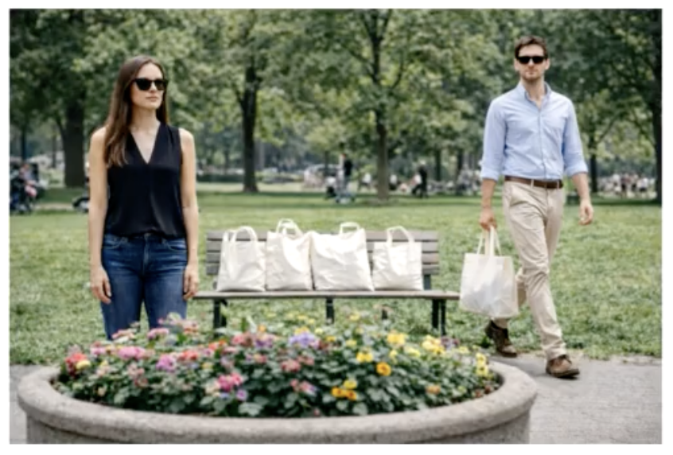

# 20260516

## TODO
- [X] 0. 미라클 모닝(30분 러닝)
- [X] 1. 토익스피킹 시험 접수: 260523 11:30 YBM신촌CBT센터 102979
- [ ] 2. 포트폴리오 웹사이트 정리 및 배포(github io)
- [X] 3. ADSP 정말 나에게 필요한 자격증인가?
  - [X] 쉽다고 함. 따는게 이득일 듯.
- [ ] 4. 토익스피킹 모의고사 
  - [ ] 문제 유형 분석 + 취약 유형
  - [ ] 템플릿 만들기
- [ ] 5. SWOT 분석의 토대: 왜 하는지 알아야함. 
  - [ ] 현재 나에게 취약한 것 + 필요한 것 리스트업

## WILLDO
- [ ] 0. 미라클 모닝(30분 러닝)
- [ ] 1. 토익스피킹 모의고사 (8회분)
- [ ] 2. 랩미팅 케이스 픽스
- [ ] 3. HBM 방열 구조. 열량 및 재료 물성 문헌 검토.
  - [ ] patent 기반으로 확인할 수 있으면 제일 좋음


## 토익스피킹 유형분석

- 유형1: 그냥 따라읽기 (45초/45초) --> OK
- 유형2: 그림 설명하기 (45초/30초) --> 연습 및 템플릿 필요
- 유형3: 롤플레잉 (5,6 3초/15초 7 3초/30초)

```
유형2 템플릿 - 30초
1: 인물, 상황, 배경, 분위기(+alpha)
2: 세부1 인물 중심
3: 세부2 상황 중심
1. 세부3 배경 중심 (분량 늘리기; 시간에 따라 완급 조절)
2. 세부4 분위기 중심
```


<table>
  <colgroup>
    <col style="width: 150px;">
    <col style="width: 260px;">
    <col style="width: 350px;">
  </colgroup>
  <thead>
    <tr>
      <th>Image</th>
      <th>Notes</th>
      <th>Description</th>
    </tr>
  </thead>
  <tbody>
    <tr>
      <td>
        
      </td>
      <td>
        1. 여자 3명, 회의, 밝은 오피스<br>
        2. 가운데 여성이 서서 종이 자료 설명<br>
        3. 좌우 여성은 앉아서 문서 확인<br>
        4. 테이블 위 노트북, 종이, 커피<br>
        5. 밝고 모던한 오피스 분위기<br>
        6. 전체적으로 우호적인 업무 분위기
      </td>
      <td>
        This picture shows three women having a discussion in a bright office.
        Two women are sitting at a table, while another woman is standing between them and showing them a document.
        They all seem focused and relaxed, so I think they are working together on a project or reviewing some business materials.
        On the table, there is a laptop, several papers, and a coffee cup.
        The office looks clean and modern, with large windows, shelves, and a plant in the background.
        Overall, it looks like a productive and friendly workplace meeting.
      </td>
    </tr>
  </tbody>
</table>


<table>
  <colgroup>
    <col style="width: 150px;">
    <col style="width: 270px;">
    <col style="width: 350px;">
  </colgroup>
  <thead>
    <tr>
      <th>Image</th>
      <th>Notes</th>
      <th>Description</th>
    </tr>
  </thead>
  <tbody>
    <tr>
      <td>
        
      </td>
      <td>
        1. 남자 1명, 여자 1명, 공원 <br>
        2. 두 사람 모두 선글라스 착용 <br>
        3. 가운 데 벤치 위에 흰색 쇼핑백 여러 개 <br>
        4. 남자는 오른쪽에서 쇼핑백, 여자 왼쪽 서있음 <br>
        5. 앞쪽에는 꽃밭, 뒤쪽에는 나무와 잔디 <br>
        6. 밝고 평화로운 공원 분위기
      </td>
      <td>
        This picture shows a man and a woman in a park on a bright day. Those two people are wearing a black sunglasses. Between them, I see several white shopping bags placed on a bench. The man on the right side is holding a shopping bag which might have been taken from the bench. He's walking through the center of the picture. On the left side, the woman seems to be waiting for someone. Overall, the atmosphere is very bright and fresh.
      </td>
    </tr>
  </tbody>
</table>